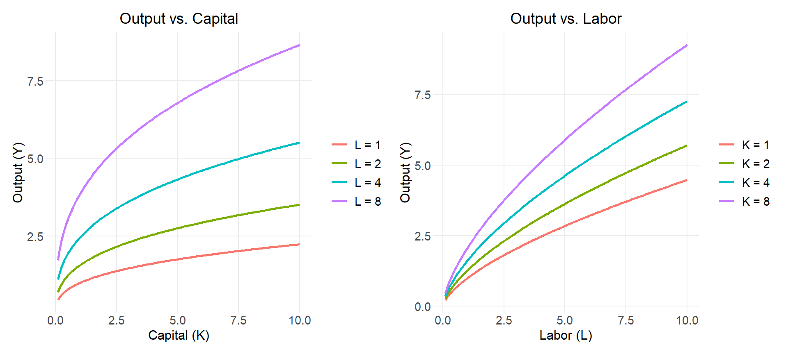
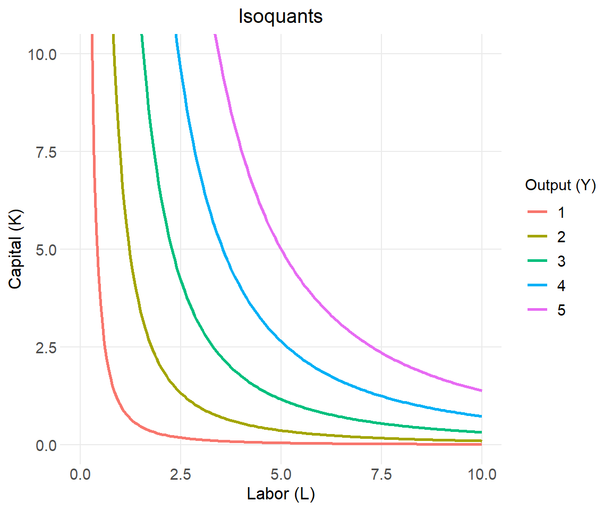
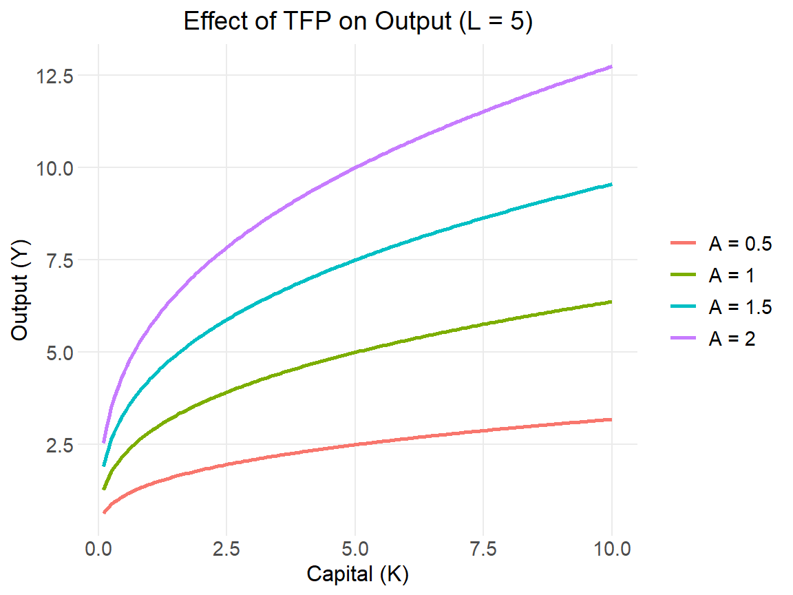
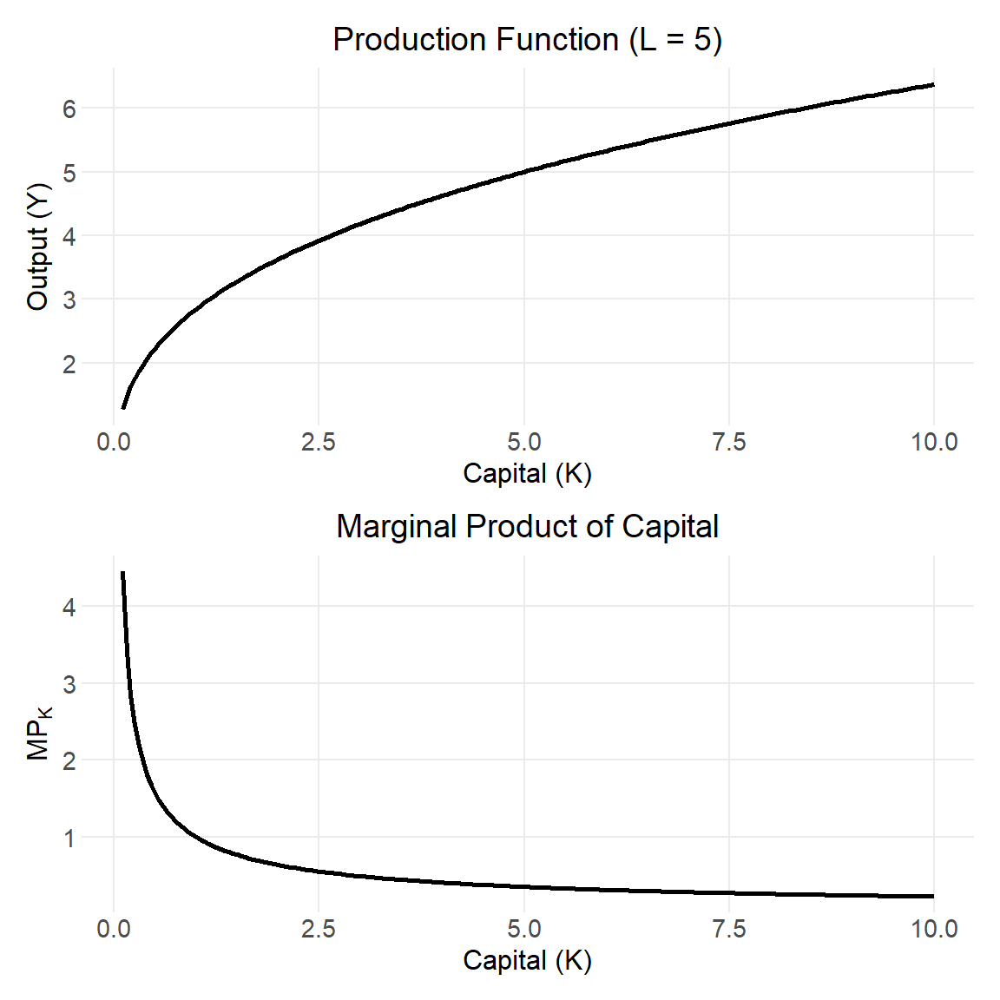
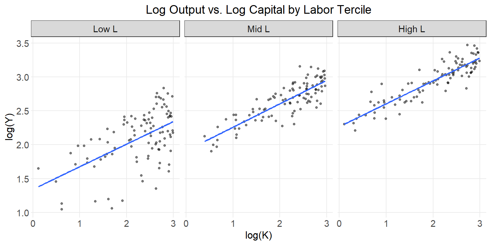
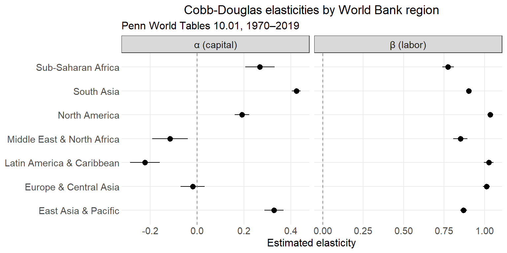

## Introduction

The Cobb-Douglas production function is one of the most widely used functional forms in economics. First estimated empirically by Charles Cobb and Paul Douglas in 1928, it describes how two inputs—capital ($K$) and labor ($L$)—combine to produce aggregate output ($Y$):

$$Y = A K^\alpha L^\beta$$

where:

- $A > 0$ is **total factor productivity** (TFP), capturing technology and overall efficiency
- $\alpha > 0$ is the output elasticity of capital
- $\beta > 0$ is the output elasticity of labor

The most common restriction is **constant returns to scale**, which requires $\alpha + \beta = 1$. Under this assumption, the function simplifies to:

$$Y = A K^\alpha L^{1-\alpha}$$

This single-parameter version ($\alpha$) is the form used throughout this tutorial unless stated otherwise.

---

## Key Properties

### Returns to scale

Scale both inputs by a factor $\lambda > 0$:

$$A(\lambda K)^\alpha (\lambda L)^{1-\alpha} = \lambda^{\alpha + (1-\alpha)} A K^\alpha L^{1-\alpha} = \lambda Y$$

Output scales exactly proportionally, confirming constant returns to scale. More generally:

| Condition | Returns to scale |
|---|---|
| $\alpha + \beta > 1$ | Increasing |
| $\alpha + \beta = 1$ | Constant |
| $\alpha + \beta < 1$ | Decreasing |

### Output elasticities

The output elasticity of capital is the percentage increase in output from a 1% increase in $K$, holding $L$ fixed:

$$\epsilon_K = \frac{\partial Y}{\partial K} \cdot \frac{K}{Y} = \alpha$$

Similarly, $\epsilon_L = 1 - \alpha$. These are **constant**—they do not depend on the level of inputs. This is a distinctive and somewhat restrictive feature of the Cobb-Douglas form.

Under perfect competition, $\alpha$ equals capital's share of national income and $(1-\alpha)$ equals labor's share—a result roughly consistent with empirical data in many countries, where capital's share tends to be around 0.30–0.40.

### Marginal products

The marginal product of capital:

$$MP_K = \frac{\partial Y}{\partial K} = \alpha \frac{Y}{K}$$

The marginal product of labor:

$$MP_L = \frac{\partial Y}{\partial L} = (1-\alpha) \frac{Y}{L}$$

Both are positive and **diminishing**—each additional unit of an input contributes less as the quantity of that input grows. This is a consequence of the concavity of the function in each input.

::: {.callout-note}
## Inada conditions

The Cobb-Douglas function satisfies the Inada conditions: as $K \to 0$, $MP_K \to \infty$; as $K \to \infty$, $MP_K \to 0$. These boundary properties ensure interior solutions in optimization problems such as the Solow growth model.
:::

---

## Visualization

We set baseline parameters $A = 1$ and $\alpha = 0.35$, consistent with a typical capital share estimate.


::: {.cell}

```{.r .cell-code}
library(tidyverse)
library(patchwork)

A     <- 1
alpha <- 0.35
```
:::


### Production curves

Holding one input fixed, we trace output as the other input varies. Each curve represents a different fixed level of the other input.


::: {.cell}

```{.r .cell-code}
df_K <- expand_grid(
  K = seq(0.1, 10, by = 0.05),
  L = c(1, 2, 4, 8)
) |>
  mutate(
    Y       = A * K^alpha * L^(1 - alpha),
    L_label = paste0("L = ", L)
  )

df_L <- expand_grid(
  L = seq(0.1, 10, by = 0.05),
  K = c(1, 2, 4, 8)
) |>
  mutate(
    Y       = A * K^alpha * L^(1 - alpha),
    K_label = paste0("K = ", K)
  )

p1 <- ggplot(df_K, aes(x = K, y = Y, color = factor(L_label))) +
  geom_line(linewidth = 0.9) +
  labs(
    title = "Output vs. Capital",
    x = "Capital (K)", y = "Output (Y)", color = NULL
  )

p2 <- ggplot(df_L, aes(x = L, y = Y, color = factor(K_label))) +
  geom_line(linewidth = 0.9) +
  labs(
    title = "Output vs. Labor",
    x = "Labor (L)", y = "Output (Y)", color = NULL
  )

p1 + p2
```

::: {.cell-output-display}
{#fig-prod-curves width=960}
:::
:::


Each curve exhibits diminishing returns: output grows at a decreasing rate as the input increases. Raising the fixed input shifts the entire curve upward.

### Isoquants

An **isoquant** is the set of all $(K, L)$ combinations that yield the same output level. From $Y = AK^\alpha L^{1-\alpha}$, solving for $K$:

$$K = \left(\frac{Y}{A L^{1-\alpha}}\right)^{1/\alpha}$$


::: {.cell}

```{.r .cell-code}
df_iso <- expand_grid(
  L = seq(0.2, 10, by = 0.05),
  Y = c(1, 2, 3, 4, 5)
) |>
  mutate(K = (Y / (A * L^(1 - alpha)))^(1 / alpha))

ggplot(df_iso, aes(x = L, y = K, color = factor(Y), group = factor(Y))) +
  geom_line(linewidth = 0.9) +
  coord_cartesian(xlim = c(0, 10), ylim = c(0, 10)) +
  labs(
    title = "Isoquants",
    x = "Labor (L)", y = "Capital (K)",
    color = "Output (Y)"
  )
```

::: {.cell-output-display}
{#fig-isoquants width=576}
:::
:::


The isoquants are downward-sloping and convex to the origin, reflecting the fact that as you substitute one input for the other, the marginal rate of technical substitution (MRTS) changes. The MRTS for Cobb-Douglas is:

$$MRTS_{L,K} = \frac{MP_L}{MP_K} = \frac{(1-\alpha)}{\alpha} \cdot \frac{K}{L}$$

### Effect of total factor productivity

$A$ shifts the production function proportionally—it amplifies output at every input combination without altering the function's curvature. This is the mechanism through which technological change operates in growth models.


::: {.cell}

```{.r .cell-code}
df_tfp <- expand_grid(
  K     = seq(0.1, 10, by = 0.05),
  A_val = c(0.5, 1.0, 1.5, 2.0)
) |>
  mutate(
    Y       = A_val * K^alpha * 5^(1 - alpha),
    A_label = paste0("A = ", A_val)
  )

ggplot(df_tfp, aes(x = K, y = Y, color = factor(A_label))) +
  geom_line(linewidth = 0.9) +
  labs(
    title = "Effect of TFP on Output (L = 5)",
    x = "Capital (K)", y = "Output (Y)", color = NULL
  )
```

::: {.cell-output-display}
{#fig-tfp width=576}
:::
:::


### Diminishing marginal returns

The marginal product of capital ($MP_K = \alpha Y / K$) declines as $K$ rises. This is the core mechanism behind the Solow model's prediction of convergence: poorer countries with less capital have higher marginal returns, which drives faster investment and growth until steady state is reached.


::: {.cell}

```{.r .cell-code}
df_mp <- tibble(K = seq(0.1, 10, by = 0.05)) |>
  mutate(
    Y    = A * K^alpha * 5^(1 - alpha),
    MP_K = alpha * Y / K
  )

p_prod <- ggplot(df_mp, aes(x = K, y = Y)) +
  geom_line(linewidth = 0.9) +
  labs(title = "Production Function (L = 5)", x = "Capital (K)", y = "Output (Y)")

p_mp <- ggplot(df_mp, aes(x = K, y = MP_K)) +
  geom_line(linewidth = 0.9) +
  labs(
    title = "Marginal Product of Capital",
    x = "Capital (K)",
    y = expression(MP[K])
  )

p_prod / p_mp
```

::: {.cell-output-display}
{#fig-mpk width=576}
:::
:::


---

## The log-linear form

Taking the natural log of $Y = AK^\alpha L^{1-\alpha}$:

$$\ln Y = \ln A + \alpha \ln K + (1-\alpha) \ln L$$

This is **linear in logs**, making OLS estimation straightforward. Relaxing the CRS restriction gives the estimable form:

$$\ln Y = a + \alpha \ln K + \beta \ln L + \varepsilon$$

where $a = \ln A$. The CRS restriction $\alpha + \beta = 1$ is testable.

---

## Estimation with simulated data

To illustrate estimation, we generate data from a known Cobb-Douglas process and recover the parameters via OLS in log-linear form.


::: {.cell}

```{.r .cell-code}
set.seed(3819)

n          <- 300
true_A     <- 1.5
true_alpha <- 0.35

sim_data <- tibble(
  K = runif(n, 1, 20),
  L = runif(n, 1, 20)
) |>
  mutate(
    # True output with multiplicative noise
    Y = true_A * K^true_alpha * L^(1 - true_alpha) * exp(rnorm(n, 0, 0.10))
  )
```
:::


::: {.cell}

```{.r .cell-code}
sim_data |>
  mutate(L_tercile = ntile(L, 3) |> factor(labels = c("Low L", "Mid L", "High L"))) |>
  ggplot(aes(x = log(K), y = log(Y))) +
  geom_point(size = 1, alpha = 0.5) +
  geom_smooth(method = "lm", se = FALSE, linewidth = 0.8) +
  facet_wrap(~L_tercile) +
  labs(
    title = "Log Output vs. Log Capital by Labor Tercile",
    x = "log(K)", y = "log(Y)"
  )
```

::: {.cell-output-display}
{#fig-sim-scatter width=768}
:::
:::


::: {.cell}

```{.r .cell-code}
model <- lm(log(Y) ~ log(K) + log(L), data = sim_data)

broom::tidy(model, conf.int = TRUE) |>
  mutate(
    term = case_when(
      term == "(Intercept)" ~ "ln A  (intercept)",
      term == "log(K)"      ~ "α  (capital elasticity)",
      term == "log(L)"      ~ "β  (labor elasticity)"
    )
  ) |>
  select(Term = term, Estimate = estimate, `Std. Error` = std.error,
         `95% CI low` = conf.low, `95% CI high` = conf.high) |>
  knitr::kable(digits = 3)
```

::: {.cell-output-display}


|Term                    | Estimate| Std. Error| 95% CI low| 95% CI high|
|:-----------------------|--------:|----------:|----------:|-----------:|
|ln A  (intercept)       |    0.455|      0.029|      0.397|       0.512|
|α  (capital elasticity) |    0.342|      0.009|      0.325|       0.359|
|β  (labor elasticity)   |    0.639|      0.009|      0.621|       0.657|


:::
:::


The estimated $\hat{\alpha}$ and $\hat{\beta}$ should be close to the true values of 0.35 and 0.65. We can also check the sum $\hat{\alpha} + \hat{\beta}$ as an informal test of the CRS restriction:


::: {.cell}

```{.r .cell-code}
coefs     <- coef(model)
alpha_hat <- coefs["log(K)"]
beta_hat  <- coefs["log(L)"]

cat("α̂ + β̂ =", round(alpha_hat + beta_hat, 3), "\n")
```

::: {.cell-output .cell-output-stdout}

```
α̂ + β̂ = 0.981 
```


:::

```{.r .cell-code}
cat("Implied A =", round(exp(coefs["(Intercept)"]), 3), "\n")
```

::: {.cell-output .cell-output-stdout}

```
Implied A = 1.58 
```


:::
:::


::: {.callout-note}
## Caveat: simultaneity bias

In practice, OLS estimation of the Cobb-Douglas production function is complicated by **simultaneity**—firms adjust inputs in response to productivity shocks, making $K$ and $L$ correlated with the error term. Methods such as instrumental variables or the Olley-Pakes estimator are commonly used to address this.
:::

---

## Estimation with Penn World Tables data

The simulated example above recovers known parameters by construction. A more meaningful test is whether the log-linear form fits real macroeconomic data and whether the estimated elasticities align with the theoretical prediction that $\alpha \approx$ capital's income share.

We use **Penn World Tables 10.01**, a harmonized panel of national accounts data covering 183 countries from 1950–2019. The key variables are:

| PWT variable | Role |
|---|---|
| `rgdpna` | Real GDP at constant 2017 national prices — output $Y$ |
| `rkna` | Capital stock at constant 2017 national prices — $K$ |
| `emp` | Persons engaged (millions) |
| `hc` | Human capital index — adjusts labor for education and returns to schooling |
| `labsh` | Labor income share — an independent check on $\hat\beta$ |

Labor is measured as quality-adjusted workers: $L^* = \text{hc} \times \text{emp}$.

::: {.callout-note}
## Installation

This section requires two packages not loaded elsewhere in this document. Install them once before rendering:

```r
install.packages(c("pwt10", "countrycode"))
```
:::


::: {.cell}

```{.r .cell-code}
library(pwt10)
library(countrycode)

data("pwt10.01")

pwt <- pwt10.01 |>
  select(country, isocode, year, rgdpna, rkna, emp, hc, labsh) |>
  mutate(
    L_adj        = hc * emp,
    region = countrycode(isocode, "iso3c", "region")
  ) |>
  filter(
    year >= 1970,
    if_all(c(rgdpna, rkna, L_adj), ~ . > 0 & !is.na(.)),
    !is.na(region)
  )
```
:::


### Pooled OLS

A single regression across all countries and years gives baseline estimates of $\alpha$ and $\beta$.


::: {.cell}

```{.r .cell-code}
pooled <- lm(log(rgdpna) ~ log(rkna) + log(L_adj), data = pwt)

broom::tidy(pooled, conf.int = TRUE) |>
  mutate(
    term = case_when(
      term == "(Intercept)"  ~ "ln A  (intercept)",
      term == "log(rkna)"   ~ "α  (capital elasticity)",
      term == "log(L_adj)"  ~ "β  (labor elasticity)"
    )
  ) |>
  select(Term = term, Estimate = estimate, `Std. Error` = std.error,
         `95% CI low` = conf.low, `95% CI high` = conf.high) |>
  knitr::kable(digits = 3)
```

::: {.cell-output-display}


|Term                    | Estimate| Std. Error| 95% CI low| 95% CI high|
|:-----------------------|--------:|----------:|----------:|-----------:|
|ln A  (intercept)       |    9.536|      0.026|      9.485|       9.586|
|α  (capital elasticity) |    0.105|      0.016|      0.074|       0.135|
|β  (labor elasticity)   |    0.966|      0.007|      0.952|       0.981|


:::
:::


We can also test the CRS restriction $\alpha + \beta = 1$ formally:


::: {.cell}

```{.r .cell-code}
car::linearHypothesis(pooled, "log(rkna) + log(L_adj) = 1") |>
  broom::tidy() |>
  select(`Null hypothesis` = term, `F statistic` = statistic, `p-value` = p.value) |>
  knitr::kable(digits = 3)
```

::: {.cell-output-display}


|Null hypothesis        | F statistic| p-value|
|:----------------------|-----------:|-------:|
|log(rkna) + log(L_adj) |        19.1|       0|


:::
:::


### Cross-country comparison by income group

Pooling all countries imposes common elasticities, masking heterogeneity across development levels. We estimate the model separately for each World Bank geographic region.


::: {.cell}

```{.r .cell-code}
by_region <- pwt |>
  nest_by(region) |>
  mutate(
    model  = list(lm(log(rgdpna) ~ log(rkna) + log(L_adj), data = data)),
    tidied = list(broom::tidy(model, conf.int = TRUE))
  ) |>
  unnest(tidied) |>
  filter(term != "(Intercept)") |>
  mutate(
    param = if_else(term == "log(rkna)", "α (capital)", "β (labor)")
  ) |>
  select(region, param, estimate, conf.low, conf.high)

by_region |>
  pivot_wider(
    names_from  = param,
    values_from = c(estimate, conf.low, conf.high)
  ) |>
  mutate(
    `α + β` = `estimate_α (capital)` + `estimate_β (labor)`
  ) |>
  select(
    Region         = region,
    `α̂`           = `estimate_α (capital)`,
    `β̂`           = `estimate_β (labor)`,
    `α̂ + β̂`       = `α + β`
  ) |>
  knitr::kable(digits = 3)
```

::: {.cell-output-display}


|Region                     |      α̂|     β̂| α̂ + β̂|
|:--------------------------|------:|-----:|-----:|
|East Asia & Pacific        |  0.328| 0.871| 1.198|
|Europe & Central Asia      | -0.019| 1.011| 0.993|
|Latin America & Caribbean  | -0.222| 1.026| 0.804|
|Middle East & North Africa | -0.115| 0.851| 0.736|
|North America              |  0.192| 1.035| 1.226|
|South Asia                 |  0.423| 0.903| 1.326|
|Sub-Saharan Africa         |  0.268| 0.775| 1.042|


:::
:::


::: {.cell}

```{.r .cell-code}
by_region |>
  mutate(region = fct_reorder(region, estimate)) |>
  ggplot(aes(x = estimate, y = region)) +
  geom_pointrange(aes(xmin = conf.low, xmax = conf.high)) +
  geom_vline(xintercept = 0, linetype = "dashed", color = "grey50") +
  facet_wrap(~param, scales = "free_x") +
  labs(
    title = "Cobb-Douglas elasticities by World Bank region",
    subtitle = "Penn World Tables 10.01, 1970–2019",
    x = "Estimated elasticity", y = NULL
  )
```

::: {.cell-output-display}
{#fig-pwt-elasticities width=768}
:::
:::


### Cross-check: estimated $\hat\beta$ vs. observed labor share

Under competitive factor markets, the labor elasticity $\beta$ should equal the observed labor income share. We compare the two directly.


::: {.cell}

```{.r .cell-code}
pwt |>
  filter(!is.na(labsh)) |>
  group_by(region) |>
  summarise(
    `Mean observed labor share` = mean(labsh, na.rm = TRUE),
    .groups = "drop"
  ) |>
  left_join(
    by_region |>
      filter(param == "β (labor)") |>
      select(region, `Estimated β` = estimate),
    by = "region"
  ) |>
  mutate(Difference = `Estimated β` - `Mean observed labor share`) |>
  knitr::kable(digits = 3)
```

::: {.cell-output-display}


|region                     | Mean observed labor share| Estimated β| Difference|
|:--------------------------|-------------------------:|-----------:|----------:|
|East Asia & Pacific        |                     0.516|       0.871|      0.354|
|Europe & Central Asia      |                     0.574|       1.011|      0.438|
|Latin America & Caribbean  |                     0.511|       1.026|      0.515|
|Middle East & North Africa |                     0.395|       0.851|      0.456|
|North America              |                     0.648|       1.035|      0.386|
|South Asia                 |                     0.521|       0.903|      0.382|
|Sub-Saharan Africa         |                     0.532|       0.775|      0.243|


:::
:::


::: {.callout-note}
## Interpretation

- The pooled estimates should yield $\hat\alpha \approx 0.35$ and $\hat\beta \approx 0.60$, broadly consistent with the empirical macro literature.
- Regions with more capital-intensive economies (e.g., Europe & Central Asia, North America) tend to show higher $\hat\alpha$; labor-abundant regions (e.g., South Asia, Sub-Saharan Africa) tend to show higher $\hat\beta$.
- The comparison of $\hat\beta$ to observed labor shares is an informal test of the competitive markets assumption. Sizable gaps suggest either market power, mismeasurement, or model misspecification.
- These are pooled OLS estimates. The simultaneity concern noted earlier applies here too; country fixed effects or IV methods would be needed for causal inference.
:::

---

## Summary

| Property | Expression |
|---|---|
| Production function | $Y = AK^\alpha L^{1-\alpha}$ |
| Returns to scale | Constant ($\alpha + (1-\alpha) = 1$) |
| Output elasticity of capital | $\alpha$ |
| Output elasticity of labor | $1 - \alpha$ |
| Marginal product of capital | $\alpha \cdot Y / K$ |
| Marginal product of labor | $(1-\alpha) \cdot Y / L$ |
| MRTS | $\frac{(1-\alpha)}{\alpha} \cdot \frac{K}{L}$ |
| Log-linear form | $\ln Y = \ln A + \alpha \ln K + (1-\alpha) \ln L$ |

The Cobb-Douglas function's tractability—closed-form derivatives, linear-in-logs estimation, and clean income-share interpretation—explains its enduring place in macroeconomics, growth theory, and applied work. Its main limitation is the fixed elasticity of substitution between capital and labor (always equal to 1), which more general forms such as the CES function relax.
