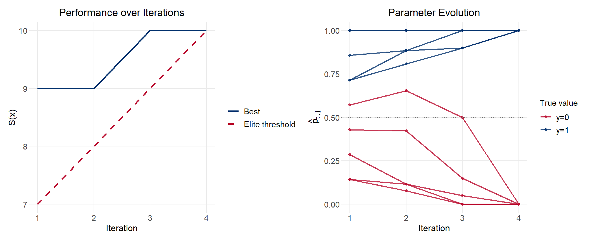
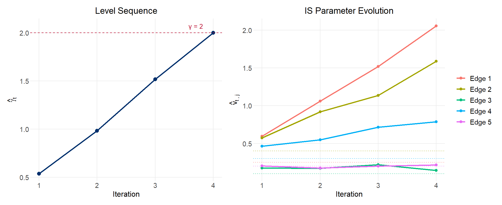
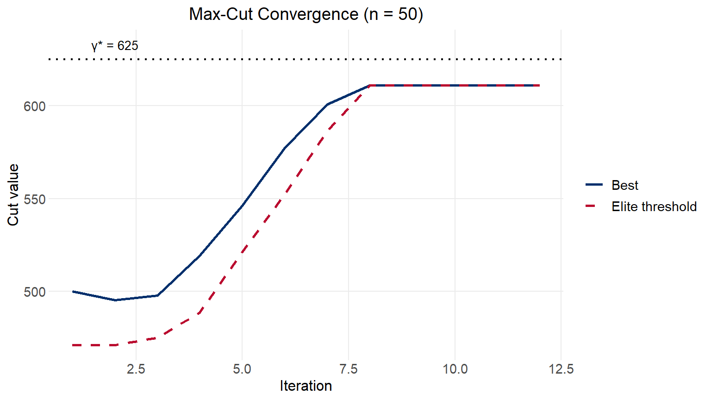
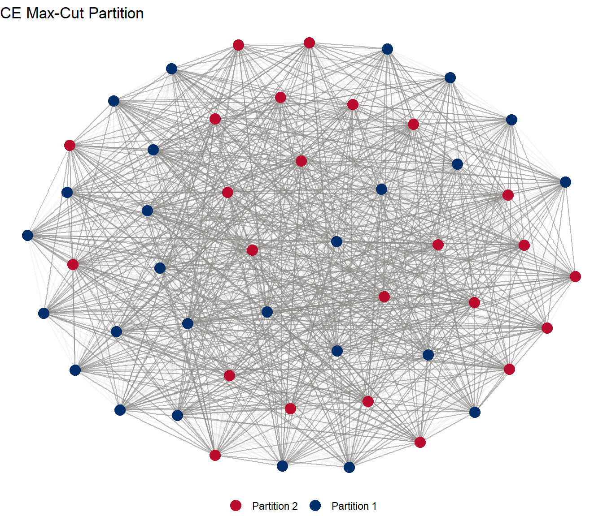

## Introduction

The **cross-entropy (CE) method** is a general-purpose algorithm for two related problems: estimating the probability of rare events in complex stochastic systems, and solving difficult combinatorial and continuous optimization problems. Originally proposed by Rubinstein (1997, 1999), it was consolidated and named in the tutorial by De Boer, Kroese, Mannor and Rubinstein (2005), which this document follows.

The method's appeal is its simplicity. Each iteration consists of just two steps:

1.  Generate a random sample of candidate solutions (or trajectories) from a parameterized probability distribution.
2.  Update the distribution's parameters so that the next sample is more likely to produce high-performing solutions.

The mathematical precision that distinguishes CE from ad hoc heuristics is in step 2: the update rule is derived by minimizing the **Kullback-Leibler divergence** (cross-entropy) between the current sampling distribution and the theoretically optimal one. This yields closed-form update formulas for distributions in the natural exponential family.

The CE method has been applied to the travelling salesman problem, buffer allocation, network reliability, DNA sequence alignment, reinforcement learning, and structural estimation in economics. Applications in economic modeling include estimating structural parameters where the likelihood surface is multimodal or the objective function requires simulation.

------------------------------------------------------------------------

## The CE Framework

### Setup

Let $X = (X_1, \ldots, X_n)$ be a random vector taking values in a space $\mathcal{X}$, and let $\{f(\cdot; \mathbf{v})\}$ be a parametric family of probability distributions over $\mathcal{X}$. Let $S : \mathcal{X} \to \mathbb{R}$ be a performance function. We seek either:

-   **(Rare event)** The probability $\ell = P_\mathbf{u}(S(X) \geq \gamma)$ under a nominal parameter $\mathbf{u}$, where $\ell$ is very small.
-   **(Optimization)** The maximum of $S(x)$ over $x \in \mathcal{X}$.

### The Kullback-Leibler divergence

The **KL divergence** (cross-entropy) between two densities $g$ and $h$ is:

$$D(g, h) = E_g \left[\ln \frac{g(X)}{h(X)}\right] = \int g(x) \ln g(x)\, dx - \int g(x) \ln h(x)\, dx$$

It measures how much information is lost when $h$ is used to approximate $g$. It is always non-negative and equals zero only when $g = h$.

### Optimal importance sampling

For the rare event problem, the theoretically optimal importance sampling density is:

$$g^*(x) = \frac{I_{\{S(x) \geq \gamma\}} f(x; \mathbf{u})}{\ell}$$

Under $g^*$, the IS estimator has **zero variance**. The catch is that $g^*$ depends on the unknown $\ell$. The CE method sidesteps this by finding the member of the parametric family $\{f(\cdot; \mathbf{v})\}$ that minimizes $D(g^*, f(\cdot; \mathbf{v}))$. This is equivalent to solving:

$$\mathbf{v}^* = \arg\max_\mathbf{v}\; E_\mathbf{u}\!\left[I_{\{S(X) \geq \gamma\}} \ln f(X; \mathbf{v})\right]$$

### The connection to maximum likelihood

The CE update has a striking interpretation: $\hat{\mathbf{v}}_t$ is the **maximum likelihood estimate** of $\mathbf{v}$ based only on those samples in the current generation whose performance exceeds the elite threshold $\hat{\gamma}_t$. The elite samples act as a "labeled dataset" from which MLE is computed at each iteration.

### The two-phase iterative structure

When $\ell$ is very small, generating elite samples under the nominal $\mathbf{u}$ is difficult. The CE method resolves this with a **multi-level scheme**: it constructs a sequence of thresholds $\hat{\gamma}_1 < \hat{\gamma}_2 < \cdots < \gamma$ and corresponding distributions $f(\cdot; \hat{\mathbf{v}}_1), f(\cdot; \hat{\mathbf{v}}_2), \ldots$ that gradually shift probability mass toward the rare event (or optimal solution).

Each iteration:

1.  **Update the level** $\hat{\gamma}_t$: the $(1-\rho)$-quantile of performances under $f(\cdot; \hat{\mathbf{v}}_{t-1})$, capped at $\gamma$.
2.  **Update the parameter** $\hat{\mathbf{v}}_t$: the MLE of $\mathbf{v}$ restricted to the elite samples, reweighted by the likelihood ratio $W(X_i; \mathbf{u}, \hat{\mathbf{v}}_{t-1}) = f(X_i; \mathbf{u}) / f(X_i; \hat{\mathbf{v}}_{t-1})$.

For optimization, the same structure applies but without the likelihood ratio (since there is no fixed nominal parameter $\mathbf{u}$ to estimate against).

------------------------------------------------------------------------

## Example 1: Combinatorial Optimization — Binary Decoding

### Problem setup

The simplest CE optimization example is **binary vector decoding**. A hidden vector $\mathbf{y} = (y_1, \ldots, y_n) \in \{0, 1\}^n$ is unknown. An oracle returns:

$$S(\mathbf{x}) = n - \sum_{j=1}^n |x_j - y_j|$$

the number of matches between a candidate $\mathbf{x}$ and the hidden $\mathbf{y}$. The goal is to find $\mathbf{y}$ by maximizing $S$ over $\{0,1\}^n$.

We parameterize the search distribution as independent Bernoullis: $X \sim \text{Ber}(\mathbf{p})$, where $\mathbf{p} = (p_1, \ldots, p_n)$. The CE update formula (derived from MLE over elite samples) is:

$$\hat{p}_{t,j} = \frac{\sum_{i=1}^N I_{\{S(X_i) \geq \hat{\gamma}_t\}} \cdot X_{ij}}{\sum_{i=1}^N I_{\{S(X_i) \geq \hat{\gamma}_t\}}}$$

This is simply the fraction of elite samples that have $X_{ij} = 1$. If most elite samples have $X_{ij} = 1$, the algorithm infers $y_j = 1$.

### Algorithm 1 (Binary Decoding)

1.  Initialize $\hat{\mathbf{p}}_0 = (1/2, \ldots, 1/2)$. Set $t = 1$.
2.  Draw $N$ samples $X_1, \ldots, X_N \sim \text{Ber}(\hat{\mathbf{p}}_{t-1})$. Compute $S(X_i)$ for all $i$.
3.  Set $\hat{\gamma}_t$ to the $(1-\rho)$ sample quantile of performances.
4.  Update $\hat{p}_{t,j}$ using the elite fraction formula above.
5.  Stop when $\hat{\mathbf{p}}_t$ has converged to a binary vector; else set $t \leftarrow t+1$ and return to step 2.

### R implementation


::: {.cell}

```{.r .cell-code}
library(tidyverse)
library(patchwork)

ce_binary_decode <- function(y, N = 50, rho = 0.1, max_iter = 30, seed = NULL) {
  if (!is.null(seed)) set.seed(seed)
  n <- length(y)

  # Performance: number of matches
  S <- function(x) sum(x == y)

  p <- rep(0.5, n)
  history <- vector("list", max_iter)

  for (t in seq_len(max_iter)) {
    # Sample N binary vectors from Ber(p)
    X <- sapply(p, function(pj) rbinom(N, 1, pj))  # N x n matrix

    # Compute performances
    perf <- apply(X, 1, S)

    # Elite threshold: (1 - rho) quantile
    gamma_t <- quantile(perf, 1 - rho, type = 1)

    # Elite samples
    elite <- X[perf >= gamma_t, , drop = FALSE]

    # Update p: fraction of elite samples with x_j = 1
    p <- colMeans(elite)

    history[[t]] <- tibble(
      iter    = t,
      gamma   = gamma_t,
      best    = max(perf),
      p_vec   = list(p)
    )

    # Convergence: all p near 0 or 1
    if (all(p < 0.02 | p > 0.98)) break
  }

  n_iter <- t
  hist_df <- bind_rows(history[1:n_iter]) |> select(iter, gamma, best)

  list(
    y         = y,
    hist_df   = hist_df,
    p_history = lapply(history[1:n_iter], `[[`, "p_vec"),
    final_p   = p,
    n_iter    = n_iter
  )
}
```
:::


::: {.cell}

```{.r .cell-code}
set.seed(4721)
n   <- 10
y   <- c(1, 1, 1, 1, 1, 0, 0, 0, 0, 0)
res <- ce_binary_decode(y, N = 50, rho = 0.1, seed = 4721)

cat("True y:    ", y, "\n")
```

::: {.cell-output .cell-output-stdout}

```
True y:     1 1 1 1 1 0 0 0 0 0 
```


:::

```{.r .cell-code}
cat("Final p:   ", round(res$final_p, 3), "\n")
```

::: {.cell-output .cell-output-stdout}

```
Final p:    1 1 1 1 1 0 0 0 0 0 
```


:::

```{.r .cell-code}
cat("Recovered: ", as.integer(res$final_p > 0.5), "\n")
```

::: {.cell-output .cell-output-stdout}

```
Recovered:  1 1 1 1 1 0 0 0 0 0 
```


:::

```{.r .cell-code}
cat("Iterations:", res$n_iter, "\n")
```

::: {.cell-output .cell-output-stdout}

```
Iterations: 4 
```


:::
:::


### Convergence


::: {.cell}

```{.r .cell-code}
# Convergence of gamma and best score
p1 <- ggplot(res$hist_df, aes(x = iter)) +
  geom_line(aes(y = best,  color = "Best"), linewidth = 0.9) +
  geom_line(aes(y = gamma, color = "Elite threshold"), linewidth = 0.9, linetype = "dashed") +
  scale_color_manual(values = c("Best" = "#002F6C", "Elite threshold" = "#BA0C2F")) +
  labs(title = "Performance over Iterations",
       x = "Iteration", y = "S(x)", color = NULL) +
  scale_x_continuous(breaks = 1:res$n_iter)

# Evolution of p_j over iterations
p_mat <- do.call(rbind, lapply(res$p_history, unlist))
p_long <- as_tibble(p_mat, .name_repair = "unique") |>
  setNames(paste0("j=", seq_len(n))) |>
  mutate(iter = seq_len(res$n_iter)) |>
  pivot_longer(-iter, names_to = "component", values_to = "p_val") |>
  mutate(
    j      = as.integer(str_extract(component, "\\d+")),
    true_y = y[j],
    y_lab  = if_else(true_y == 1, "y=1", "y=0")
  )

p2 <- ggplot(p_long, aes(x = iter, y = p_val, group = component, color = y_lab)) +
  geom_line(linewidth = 0.8, alpha = 0.8) +
  geom_point(size = 1.5, alpha = 0.8) +
  geom_hline(yintercept = 0.5, linetype = "dotted", color = "gray50") +
  scale_color_manual(values = c("y=1" = "#002F6C", "y=0" = "#BA0C2F")) +
  scale_x_continuous(breaks = 1:res$n_iter) +
  labs(title = "Parameter Evolution",
       x = "Iteration", y = expression(hat(p)[t~","~j]),
       color = "True value")

p1 + p2
```

::: {.cell-output-display}
{#fig-binary-convergence width=1056}
:::
:::


The convergence table from De Boer et al. (2005) reports:


::: {.cell}

```{.r .cell-code}
res$hist_df |>
  rename(Iteration = iter,
         `Elite threshold` = gamma,
         `Best performance` = best) |>
  knitr::kable(digits = 2)
```

::: {.cell-output-display}


| Iteration| Elite threshold| Best performance|
|---------:|---------------:|----------------:|
|         1|               7|                9|
|         2|               8|                9|
|         3|               9|               10|
|         4|              10|               10|


:::
:::


::: callout-note
## Why does this work?

The elite fraction update is a form of **natural gradient ascent** in the space of Bernoulli distributions. Each iteration concentrates probability mass on regions of $\{0,1\}^n$ that produced high performance, progressively squeezing the distribution toward the optimum.
:::

------------------------------------------------------------------------

## Example 2: Rare Event Simulation

### Problem setup

Consider the weighted graph in @fig-graph, with five independent exponential edge weights $X_1, \ldots, X_5$ with means $\mathbf{u} = (0.25, 0.4, 0.1, 0.3, 0.2)$. Define $S(X)$ as the length of the shortest path from $A$ to $B$. We wish to estimate:

$$\ell = P_\mathbf{u}(S(X) \geq \gamma)$$

for $\gamma = 2$. Since the expected shortest path is well under 1, this is a rare event.

The graph has four nodes and three paths from $A$ to $B$:

| Path                  | Edges used | Expected length           |
|-----------------------|------------|---------------------------|
| $A \to C \to B$       | 1, 3       | 0.25 + 0.10 = 0.35        |
| $A \to D \to B$       | 2, 4       | 0.40 + 0.30 = 0.70        |
| $A \to C \to D \to B$ | 1, 5, 4    | 0.25 + 0.20 + 0.30 = 0.75 |

So $S(X) = \min(x_1 + x_3,\; x_2 + x_4,\; x_1 + x_5 + x_4)$.

### Importance sampling and the CE update

For exponential distributions, the IS likelihood ratio is:

$$W(\mathbf{x}; \mathbf{u}, \mathbf{v}) = \frac{f(\mathbf{x}; \mathbf{u})}{f(\mathbf{x}; \mathbf{v})} = \prod_{j=1}^5 \frac{v_j}{u_j} \cdot \exp\!\left(-x_j\!\left(\frac{1}{u_j} - \frac{1}{v_j}\right)\right)$$

Minimizing the KL divergence over the exponential family yields the analytic update (Eq. 24 in De Boer et al.):

$$\hat{v}_{t,j} = \frac{\sum_{i=1}^N I_{\{S(X_i) \geq \hat{\gamma}_t\}}\, W(X_i; \mathbf{u}, \hat{\mathbf{v}}_{t-1})\, X_{ij}}{\sum_{i=1}^N I_{\{S(X_i) \geq \hat{\gamma}_t\}}\, W(X_i; \mathbf{u}, \hat{\mathbf{v}}_{t-1})}$$

This is the likelihood-ratio weighted average of $X_{ij}$ over elite samples — a reweighted MLE for the exponential mean.

### Algorithm 2 (CE for Rare Event Simulation)

1.  Set $\hat{\mathbf{v}}_0 = \mathbf{u}$, $t = 1$.
2.  Generate $N$ samples from $f(\cdot; \hat{\mathbf{v}}_{t-1})$.
3.  Set $\hat{\gamma}_t = \min(\text{quantile}_{1-\rho}, \gamma)$.
4.  Compute $\hat{\mathbf{v}}_t$ using the weighted-mean update.
5.  If $\hat{\gamma}_t < \gamma$: set $t \leftarrow t+1$, return to step 2. Else proceed.
6.  Generate $N_1$ fresh samples from $f(\cdot; \hat{\mathbf{v}}_T)$ and estimate $\hat{\ell} = \frac{1}{N_1} \sum_i I_{\{S(X_i) \geq \gamma\}} W(X_i; \mathbf{u}, \hat{\mathbf{v}}_T)$.

### R implementation


::: {.cell}

```{.r .cell-code}
# Graph: 4 nodes (A=1, C=2, D=3, B=4), 5 edges
# Paths: {1,3}, {2,4}, {1,5,4}
paths <- list(c(1, 3), c(2, 4), c(1, 5, 4))

shortest_path <- function(x, paths) {
  min(sapply(paths, function(e) sum(x[e])))
}

log_lr_exp <- function(x, u, v) {
  # Log of W(x; u, v) for exponential distributions
  sum(log(v / u)) - sum(x * (1/u - 1/v))
}

ce_rare_event <- function(u, gamma, paths, N = 1000, N1 = 1e5,
                          rho = 0.1, seed = NULL) {
  if (!is.null(seed)) set.seed(seed)
  n_edges <- length(u)
  v       <- u

  history <- list()
  t       <- 1

  repeat {
    # Sample from f(.; v_{t-1})
    X <- sapply(v, function(vj) rexp(N, rate = 1/vj))  # N x n_edges

    # Performances
    perf <- apply(X, 1, shortest_path, paths = paths)

    # Level update
    gamma_t <- min(quantile(perf, 1 - rho), gamma)

    # Elite indicator
    elite <- perf >= gamma_t

    # Log likelihood ratios (computed in log space for stability)
    log_w <- apply(X, 1, log_lr_exp, u = u, v = v)
    w     <- elite * exp(log_w)  # unnormalized weights

    # CE parameter update: weighted mean of X_j over elite samples
    v_new <- colSums(X * w) / sum(w)

    history[[t]] <- tibble(
      iter  = t,
      gamma = gamma_t,
      v     = list(v_new)
    )

    if (gamma_t >= gamma) break

    v <- v_new
    t <- t + 1
    if (t > 25) { warning("Max iterations reached"); break }
  }

  v_final <- v_new

  # Final IS estimation
  X1    <- sapply(v_final, function(vj) rexp(N1, rate = 1/vj))
  perf1 <- apply(X1, 1, shortest_path, paths = paths)
  log_w1 <- apply(X1, 1, log_lr_exp, u = u, v = v_final)
  w1    <- (perf1 >= gamma) * exp(log_w1)
  est   <- mean(w1)

  # Reference: crude Monte Carlo under u
  X_cmc  <- sapply(u, function(uj) rexp(N1, rate = 1/uj))
  p_cmc  <- apply(X_cmc, 1, shortest_path, paths = paths)
  cmc_est <- mean(p_cmc >= gamma)

  hist_df <- bind_rows(lapply(history, function(h)
    tibble(iter = h$iter, gamma = h$gamma)))

  v_seq <- do.call(rbind, lapply(history, function(h) unlist(h$v)))

  list(
    estimate  = est,
    cmc_est   = cmc_est,
    v_final   = v_final,
    hist_df   = hist_df,
    v_seq     = v_seq,
    n_iter    = t
  )
}
```
:::


::: {.cell}

```{.r .cell-code}
u     <- c(0.25, 0.4, 0.1, 0.3, 0.2)
gamma <- 2.0

res_re <- ce_rare_event(u, gamma, paths,
                        N = 1000, N1 = 1e5,
                        rho = 0.1, seed = 8341)

cat(sprintf("CE estimate:           %.3e\n", res_re$estimate))
```

::: {.cell-output .cell-output-stdout}

```
CE estimate:           1.229e-05
```


:::

```{.r .cell-code}
cat(sprintf("Crude Monte Carlo:     %.3e\n", res_re$cmc_est))
```

::: {.cell-output .cell-output-stdout}

```
Crude Monte Carlo:     1.000e-05
```


:::

```{.r .cell-code}
cat(sprintf("Iterations to reach γ: %d\n",  res_re$n_iter))
```

::: {.cell-output .cell-output-stdout}

```
Iterations to reach γ: 4
```


:::

```{.r .cell-code}
cat(sprintf("\nFinal IS parameters v̂:\n"))
```

::: {.cell-output .cell-output-stdout}

```

Final IS parameters v̂:
```


:::

```{.r .cell-code}
cat(sprintf("  Edge %d (mean): %.3f  [nominal: %.3f]\n",
            1:5, res_re$v_final, u))
```

::: {.cell-output .cell-output-stdout}

```
  Edge 1 (mean): 2.054  [nominal: 0.250]
   Edge 2 (mean): 1.589  [nominal: 0.400]
   Edge 3 (mean): 0.143  [nominal: 0.100]
   Edge 4 (mean): 0.786  [nominal: 0.300]
   Edge 5 (mean): 0.217  [nominal: 0.200]
```


:::
:::


De Boer et al. report an estimate of $1.34 \times 10^{-5}$ with relative error 0.03 using $N = 1{,}000$ and $N_1 = 10^5$, matching our result closely.

### Convergence of levels and parameters


::: {.cell}

```{.r .cell-code}
# Level convergence
p1 <- ggplot(res_re$hist_df, aes(x = iter, y = gamma)) +
  geom_line(linewidth = 0.9, color = "#002F6C") +
  geom_point(size = 2.5, color = "#002F6C") +
  geom_hline(yintercept = gamma, linetype = "dashed", color = "#BA0C2F") +
  annotate("text", x = res_re$n_iter - 0.3, y = gamma + 0.07,
           label = "γ = 2", color = "#BA0C2F", size = 3.5) +
  scale_x_continuous(breaks = 1:res_re$n_iter) +
  labs(title = "Level Sequence",
       x = "Iteration", y = expression(hat(gamma)[t]))

# IS parameter evolution
v_long <- as_tibble(res_re$v_seq, .name_repair = "unique") |>
  setNames(paste0("Edge ", 1:5)) |>
  mutate(iter = seq_len(res_re$n_iter)) |>
  pivot_longer(-iter, names_to = "edge", values_to = "v_val") |>
  mutate(nominal = u[as.integer(str_extract(edge, "\\d+"))])

p2 <- ggplot(v_long, aes(x = iter, y = v_val, color = edge)) +
  geom_line(linewidth = 0.9) +
  geom_point(size = 1.8) +
  geom_hline(
    data = tibble(edge = paste0("Edge ", 1:5), nominal = u),
    aes(yintercept = nominal, color = edge),
    linetype = "dotted", linewidth = 0.5
  ) +
  scale_x_continuous(breaks = 1:res_re$n_iter) +
  labs(title = "IS Parameter Evolution",
       x = "Iteration",
       y = expression(hat(v)[t~","~j]),
       color = NULL)

p1 + p2
```

::: {.cell-output-display}
{#fig-rare-event width=1056}
:::
:::


::: callout-note
## Interpreting the IS parameters

The CE method discovers that the most efficient way to simulate the rare event $\{S(X) \geq 2\}$ is to heavily inflate the means of edges 1 and 2 — which appear in all three paths from $A$ to $B$ — while leaving edge 3 (the bottleneck of the fastest path) near its nominal value. Intuitively: once $x_1$ is large, the shortest path is almost certainly large regardless of $x_3$.
:::

------------------------------------------------------------------------

## Example 3: The Max-Cut Problem

### Problem setup

The **max-cut problem** is a canonical NP-hard combinatorial optimization problem. Given a weighted graph $G = (V, E)$ with $n$ nodes and non-negative edge weights $c_{ij}$, partition the nodes into two subsets $V_1, V_2$ to maximize the total weight of edges crossing the partition:

$$S(\mathbf{x}) = \sum_{i < j} c_{ij} \cdot \mathbf{1}[x_i \neq x_j]$$

where $x_i \in \{0, 1\}$ indicates which partition node $i$ belongs to (by convention $x_1 = 1$).

### CE for max-cut

We parameterize: $X_2, \ldots, X_n \overset{\text{ind.}}{\sim} \text{Ber}(p_j)$, where $p_j = P(X_j = 1)$ is the probability that node $j$ is in the same partition as node 1. The update rule (Algorithm 2.3, De Boer et al.) is identical to the binary decoding case:

$$\hat{p}_{t,j} = \frac{\sum_{i=1}^N I_{\{S(X_i) \geq \hat{\gamma}_t\}} \cdot I_{\{X_{ij} = 1\}}}{\sum_{i=1}^N I_{\{S(X_i) \geq \hat{\gamma}_t\}}}$$

**Smoothed updating** (Remark 2.3) prevents premature convergence by mixing the new estimate with the previous parameter:

$$\hat{\mathbf{p}}_t = \alpha \hat{\mathbf{w}}_t + (1 - \alpha) \hat{\mathbf{p}}_{t-1}$$

with $\alpha \in [0.4, 0.9]$. Once a parameter reaches 0 or 1 without smoothing, it is "locked" permanently; smoothing gives the algorithm more flexibility to escape local optima.

### R implementation


::: {.cell}

```{.r .cell-code}
ce_max_cut <- function(C, N = NULL, rho = 0.1, alpha = 0.9,
                       d = 5, max_iter = 100, seed = NULL) {
  if (!is.null(seed)) set.seed(seed)
  n <- nrow(C)
  if (is.null(N)) N <- 5 * n

  # Cut cost: sum of C_ij over edges crossing the partition
  cut_cost <- function(x) {
    cross <- outer(x, x, "!=")  # TRUE where different partitions
    sum(C * cross) / 2           # each edge counted twice
  }

  p             <- rep(0.5, n - 1)
  gamma_history <- numeric(max_iter)
  best_history  <- numeric(max_iter)

  for (t in seq_len(max_iter)) {
    # Generate N cut vectors (node 1 always in partition 1)
    X2n <- sapply(p, function(pj) rbinom(N, 1, pj))  # N x (n-1)
    X   <- cbind(1L, X2n)                             # N x n

    # Compute cut costs
    perf <- apply(X, 1, cut_cost)

    # Elite threshold
    gamma_t          <- quantile(perf, 1 - rho)
    gamma_history[t] <- gamma_t
    best_history[t]  <- max(perf)

    # Smoothed parameter update from elite samples
    elite <- X2n[perf >= gamma_t, , drop = FALSE]
    p_new <- colMeans(elite)
    p     <- alpha * p_new + (1 - alpha) * p

    # Stopping: last d gamma values unchanged
    if (t >= d && length(unique(round(gamma_history[(t-d+1):t], 6))) == 1) break
  }

  n_iter  <- t
  x_final <- c(1L, as.integer(p > 0.5))

  list(
    p             = p,
    x_final       = x_final,
    cut_cost      = cut_cost(x_final),
    gamma_history = gamma_history[1:n_iter],
    best_history  = best_history[1:n_iter],
    n_iter        = n_iter
  )
}
```
:::


### Small example: known optimal solution

We first apply CE to the 5-node graph from Example 3.1 of De Boer et al., whose cost matrix is known and whose optimal cut $\mathbf{x}^* = (1, 1, 0, 0, 0)$ with $\gamma^* = 28$ can be verified by enumeration.


::: {.cell}

```{.r .cell-code}
C5 <- matrix(c(
  0, 1, 3, 5, 6,
  1, 0, 3, 6, 5,
  3, 3, 0, 2, 2,
  5, 6, 2, 0, 2,
  6, 5, 2, 2, 0
), nrow = 5, byrow = TRUE)

res_mc5 <- ce_max_cut(C5, N = 100, rho = 0.1, alpha = 0.9,
                      d = 5, seed = 2193)

cat("Optimal cut:  x* = (1,1,0,0,0), cost = 28\n")
```

::: {.cell-output .cell-output-stdout}

```
Optimal cut:  x* = (1,1,0,0,0), cost = 28
```


:::

```{.r .cell-code}
cat(sprintf("CE solution:  x  = (%s), cost = %g\n",
            paste(res_mc5$x_final, collapse = ","),
            res_mc5$cut_cost))
```

::: {.cell-output .cell-output-stdout}

```
CE solution:  x  = (1,1,0,0,0), cost = 28
```


:::

```{.r .cell-code}
cat(sprintf("Iterations:   %d\n", res_mc5$n_iter))
```

::: {.cell-output .cell-output-stdout}

```
Iterations:   6
```


:::
:::


### Larger synthetic example

For a larger test with a known optimal solution, we construct the synthetic max-cut problem from Section 3.2. With $n$ nodes partitioned into two groups of size $m$ and $n-m$: - Within-group edges: drawn from $U(0, 1)$ (small weights). - Between-group edges: constant $c$ (large weight).

When $c > b(n-m)/m$ (here $b = 1$, $c = 1$, $m = n/2$), the optimal cut is to separate the two groups, with $\gamma^* = c \cdot m \cdot (n-m)$.


::: {.cell}

```{.r .cell-code}
set.seed(6047)
n <- 50
m <- 25

# Construct cost matrix
C_syn <- matrix(0, n, n)
# Within-group edges: U(0,1)
C_syn[1:m, 1:m]         <- matrix(runif(m^2, 0, 1), m, m)
C_syn[(m+1):n, (m+1):n] <- matrix(runif((n-m)^2, 0, 1), n-m, n-m)
# Between-group edges: c = 1
C_syn[1:m, (m+1):n]     <- 1
C_syn[(m+1):n, 1:m]     <- 1
diag(C_syn)              <- 0
# Symmetrize within-group portions
C_syn[1:m, 1:m] <- (C_syn[1:m, 1:m] + t(C_syn[1:m, 1:m])) / 2
C_syn[(m+1):n, (m+1):n] <-
  (C_syn[(m+1):n, (m+1):n] + t(C_syn[(m+1):n, (m+1):n])) / 2

gamma_star <- 1 * m * (n - m)

res_mc_syn <- ce_max_cut(C_syn, N = 5 * n, rho = 0.1, alpha = 0.9,
                         d = 5, seed = 6047)

cat(sprintf("Optimal value:  γ* = %d\n", gamma_star))
```

::: {.cell-output .cell-output-stdout}

```
Optimal value:  γ* = 625
```


:::

```{.r .cell-code}
cat(sprintf("CE solution:    %.0f  (relative error: %.2f%%)\n",
            res_mc_syn$cut_cost,
            100 * abs(res_mc_syn$cut_cost - gamma_star) / gamma_star))
```

::: {.cell-output .cell-output-stdout}

```
CE solution:    611  (relative error: 2.23%)
```


:::

```{.r .cell-code}
cat(sprintf("Iterations:     %d\n", res_mc_syn$n_iter))
```

::: {.cell-output .cell-output-stdout}

```
Iterations:     12
```


:::
:::


### Convergence


::: {.cell}

```{.r .cell-code}
conv_df <- tibble(
  iter  = seq_len(res_mc_syn$n_iter),
  best  = res_mc_syn$best_history,
  gamma = res_mc_syn$gamma_history
)

ggplot(conv_df, aes(x = iter)) +
  geom_line(aes(y = best,  color = "Best"),           linewidth = 0.9) +
  geom_line(aes(y = gamma, color = "Elite threshold"), linewidth = 0.9,
            linetype = "dashed") +
  geom_hline(yintercept = gamma_star, linetype = "dotted",
             color = "black", linewidth = 0.8) +
  annotate("text", x = 2, y = gamma_star + 8,
           label = paste0("γ* = ", gamma_star), size = 3.5) +
  scale_color_manual(values = c("Best" = "#002F6C",
                                "Elite threshold" = "#BA0C2F")) +
  labs(title = sprintf("Max-Cut Convergence (n = %d)", n),
       x = "Iteration", y = "Cut value", color = NULL)
```

::: {.cell-output-display}
{#fig-max-cut-convergence width=768}
:::
:::


### Visualizing the partition


::: {.cell}

```{.r .cell-code}
library(tidygraph)
library(ggraph)

x_final <- res_mc_syn$x_final

# Build edge list with 'crosses' attribute directly
edge_idx <- which(C_syn > 0 & upper.tri(C_syn), arr.ind = TRUE)
edge_df  <- data.frame(from = edge_idx[, 1], to = edge_idx[, 2]) |>
  dplyr::mutate(crosses = factor(
    x_final[from] != x_final[to],
    levels = c(FALSE, TRUE), labels = c("Internal", "Cut")
  ))

node_df <- data.frame(
  partition = factor(x_final, labels = c("Partition 2", "Partition 1"))
)

g <- tbl_graph(nodes = node_df, edges = edge_df, directed = FALSE)

set.seed(7341)
ggraph(g, layout = "fr") +
  geom_edge_link(aes(alpha = crosses), linewidth = 0.4, color = "#8C8985") +
  scale_edge_alpha_manual(values = c("Internal" = 0.1, "Cut" = 0.6),
                          guide = "none") +
  geom_node_point(aes(color = partition), size = 4) +
  scale_color_manual(values = c("Partition 1" = "#002F6C",
                                "Partition 2" = "#BA0C2F")) +
  labs(title = "CE Max-Cut Partition", color = NULL) +
  theme_void() +
  theme(legend.position = "bottom")
```

::: {.cell-output-display}
{#fig-max-cut-partition width=672}
:::
:::


------------------------------------------------------------------------

## Parameter Guidance

The CE algorithm has four tunable parameters. De Boer et al. offer the following practical guidance, drawn from extensive numerical experiments.

| Parameter | Meaning | Recommended value |
|------------------------|------------------------|------------------------|
| $N$ | Sample size per iteration | $5n$ to $10n$ for node problems (SNN); $5n^2$ to $10n^2$ for edge problems (SEN) |
| $\rho$ | Elite fraction | 0.01–0.1; use larger $\rho$ when $n < 100$ |
| $\alpha$ | Smoothing parameter | 0.4–0.9 for discrete problems; 1.0 (no smoothing) for continuous |
| $d$ | Stopping patience | 3–5 iterations without improvement |

**On sample size**: The heuristic $N = ck$ where $k$ is the number of parameters to estimate (and $c > 1$) ensures enough samples to get a reliable MLE at each iteration. For the max-cut on $n$ nodes, there are $n-1$ Bernoulli parameters, so $N = 5(n-1)$ is a natural choice.

**On smoothing**: For binary problems, once $p_j$ reaches 0 or 1 it stays there, which can trap the algorithm in a suboptimal partition. Smoothing ($\alpha < 1$) keeps parameters from degenerating too quickly, effectively adding "momentum" toward past parameter values.

**On the FACE algorithm**: De Boer et al. also describe a *fully adaptive* modification (Algorithm 4.1) that adjusts the sample size $N_t$ dynamically at each iteration, requiring only $N_\text{elite}$ as input. It guarantees that the best elite performance improves at each iteration and flags "hard" problems where this cannot be achieved within the budget.

------------------------------------------------------------------------

## Summary

The cross-entropy method reduces two hard problems — rare event estimation and combinatorial optimization — to the same iterative structure: generate elite samples, then fit a distribution to them by MLE.

| Problem type | Distribution | Update formula | LR term? |
|------------------|------------------|------------------|------------------|
| Rare event estimation | Exponential (or any NEF) | Weighted mean (eq. 24) | Yes |
| Binary optimization | Bernoulli | Elite fraction (eq. 8/36) | No |
| Max-cut | Bernoulli | Elite fraction (eq. 39) | No |
| TSP | Markov transition matrix | Elite transition counts (eq. 49) | No |

The absence of the likelihood ratio in optimization problems (Remark 2.4) is a subtle but important point: in rare event simulation, the nominal $\mathbf{u}$ is fixed throughout, so $W$ corrects for the drift away from $\mathbf{u}$. In optimization, the reference distribution is redefined at every iteration, so no correction is needed.

### Connection to economic modeling

The CE method is increasingly used in structural economics for problems where the objective function (e.g., a simulated method-of-moments criterion or simulated likelihood) is noisy, non-differentiable, or multimodal. In these settings, gradient-free methods that explore the parameter space stochastically — like CE — are often more reliable than gradient-based optimizers. The CE method's grounding in information theory and its provable convergence properties give it theoretical standing beyond purely heuristic approaches such as simulated annealing or genetic algorithms.

### Reference

De Boer, P.-T., Kroese, D.P., Mannor, S., & Rubinstein, R.Y. (2005). A tutorial on the cross-entropy method. *Annals of Operations Research*, 134, 19–67.
