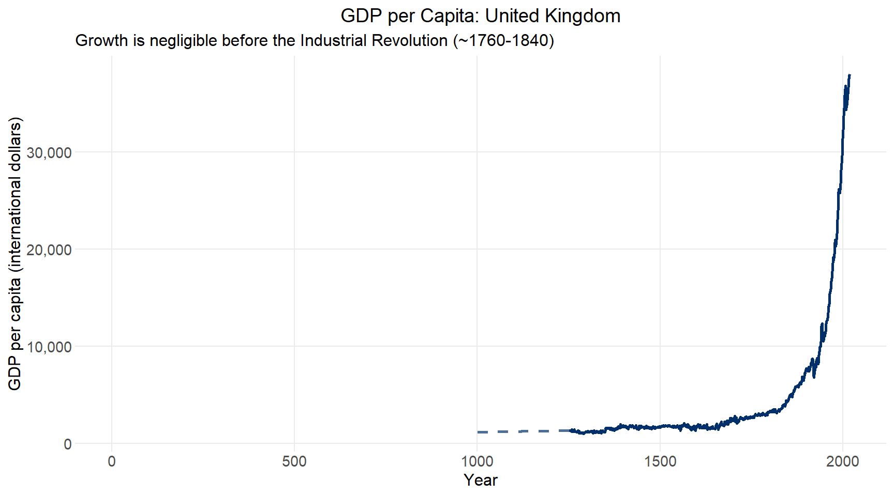
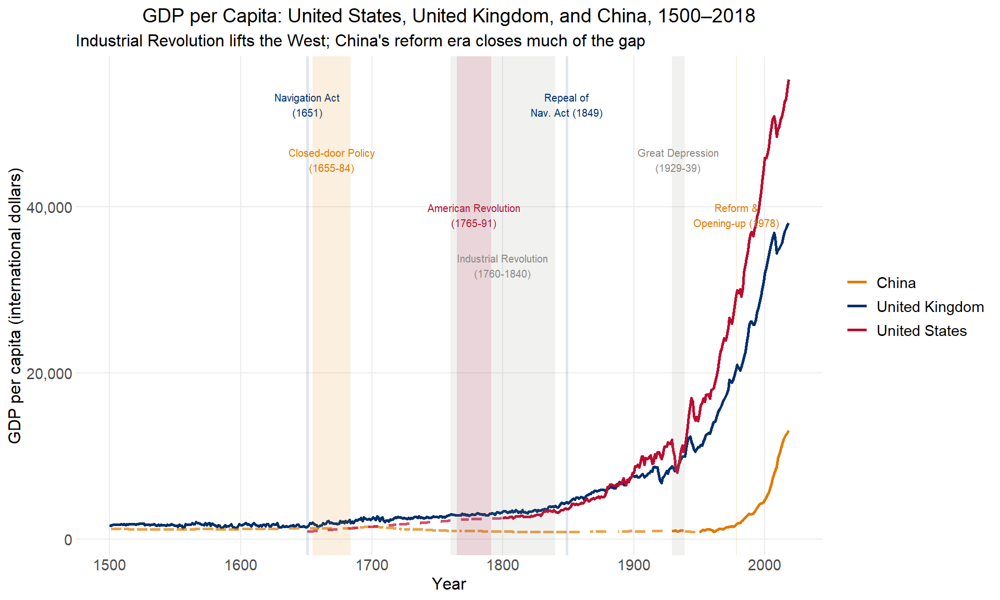
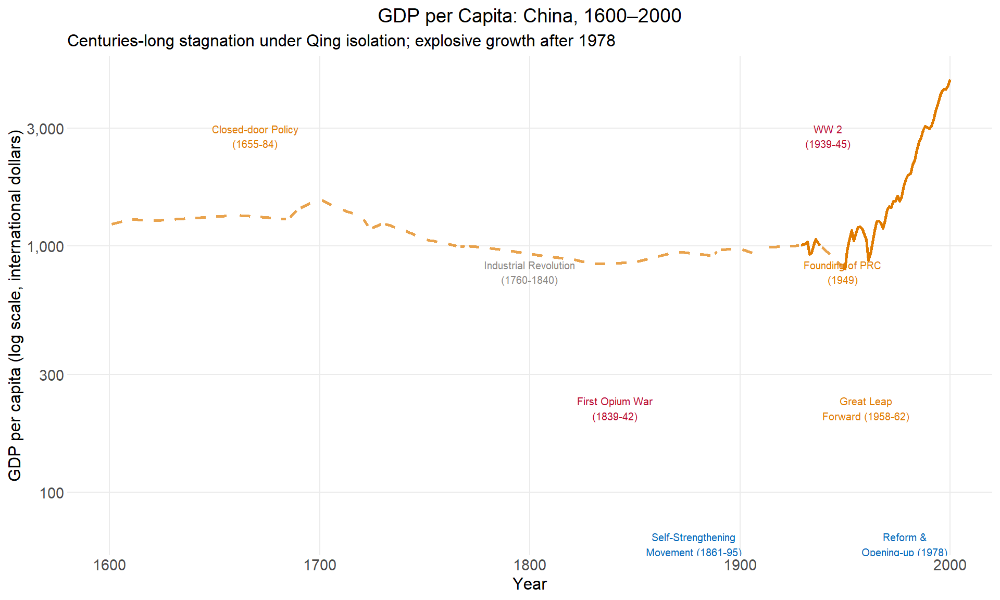
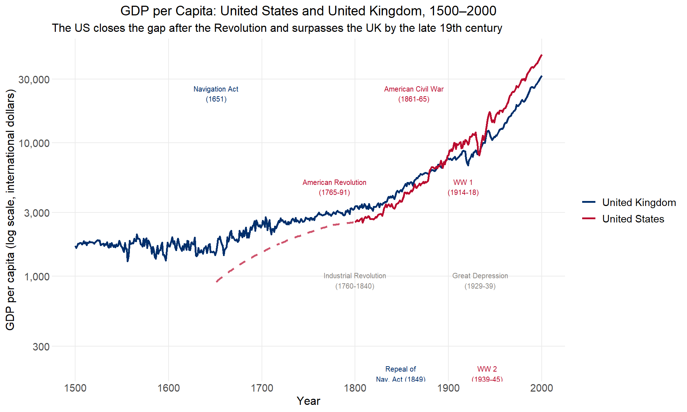
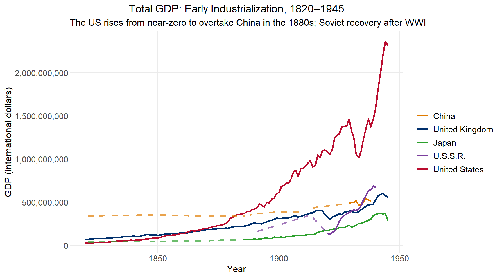
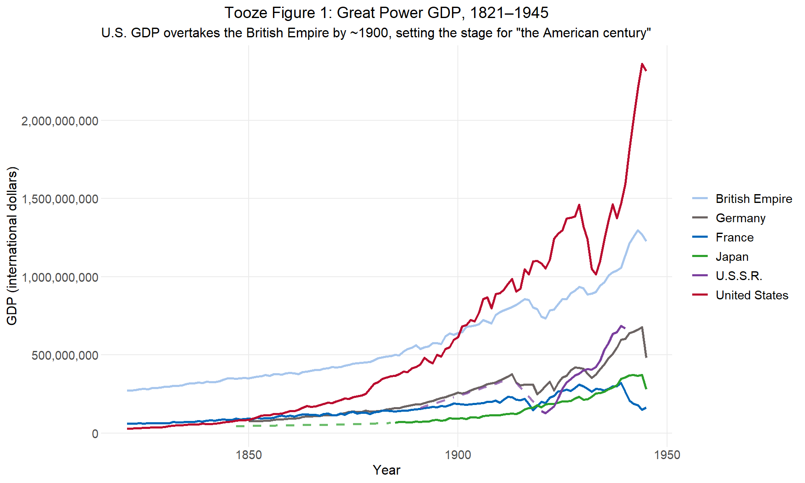
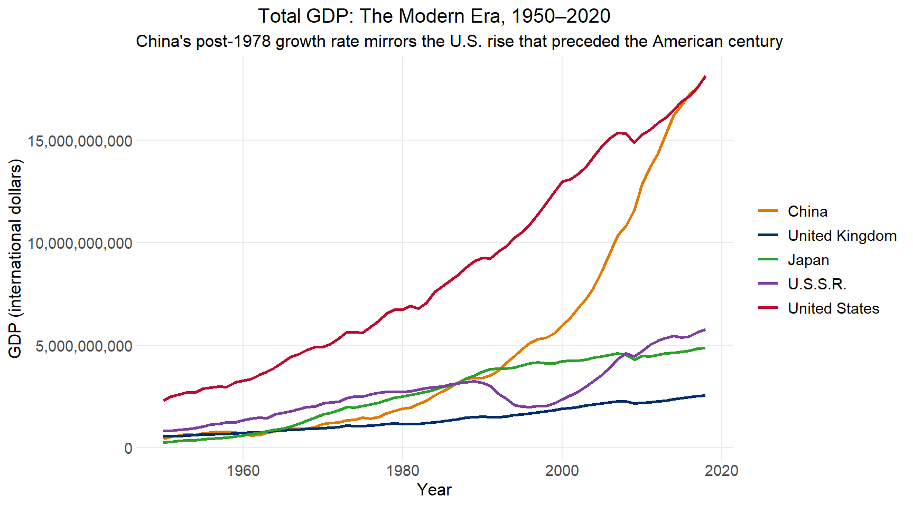
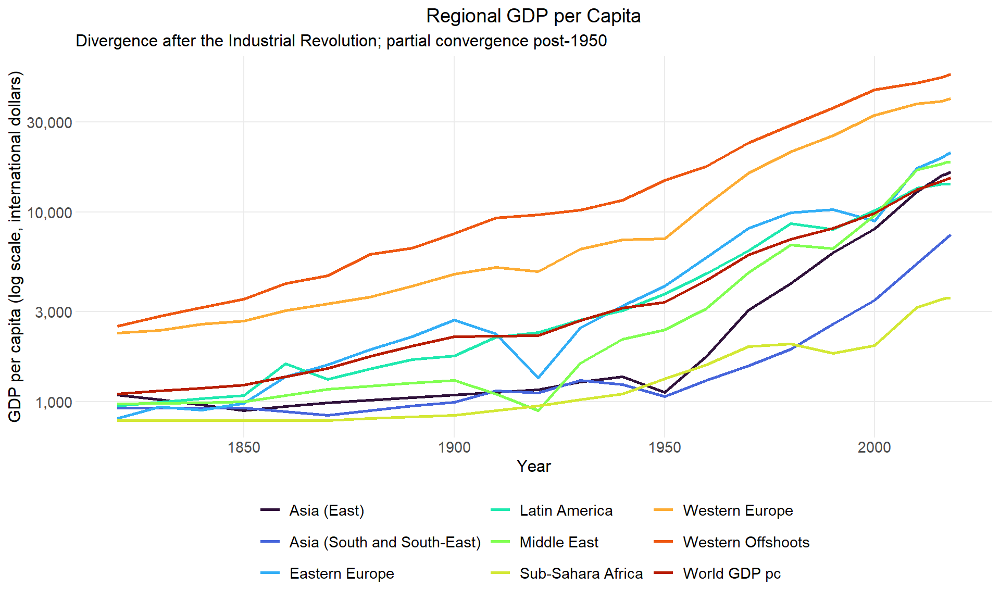

# Long-Run Growth

## Overview

This lecture uses R and ggplot2 to download, organize, and visualize historical data on economic growth, adapting the [QuantEcon Python lecture](https://intro.quantecon.org/long_run_growth.html) by Thomas Sargent and John Stachurski.

The data come from the [Maddison Historical Statistics](https://www.rug.nl/ggdc/historicaldevelopment/maddison/) project, initiated by Angus Maddison and continued by the Groningen Growth and Development Centre. The dataset contains GDP per capita and population for 169 countries, some series reaching back to the first century CE.

Growth facts of this kind matter for several reasons: they are the principal empirical targets of development economics and economic history, and they are inputs to geopolitical analysis. Adam Tooze opened *The Deluge* (2014) with a chart of how Great Power GDPs evolved in the 70 years before 1914, arguing that the US overtaking the British Empire was a key structural underpinning of the "American century." We replicate his figure below, and extend it to the present.

## Setting Up


::: {.cell}

```{.r .cell-code}
full_data <- read_excel("mpd2020.xlsx",
                        sheet="Full data") |>
  mutate(gdp = gdppc * pop)
```
:::


The dataset covers 169 countries. Coverage varies widely: the UK series runs from year 1 to 2018, while many countries only appear after 1950.


::: {.cell}

```{.r .cell-code}
full_data |>
  group_by(country) |>
  summarise(min_year = min(year), max_year = max(year), .groups = "drop") |>
  arrange(min_year) |>
  head(10)
```

::: {.cell-output-display}

```{=html}
<table class="huxtable" data-quarto-disable-processing="true"  style="margin-left: auto; margin-right: auto;" id="tab:country-range">
<col><col><col><thead>
<tr>
<th class="huxtable-cell huxtable-header" style="border-style: solid solid solid solid; border-width: 0.4pt 0pt 0.4pt 0.4pt;">country</th><th class="huxtable-cell huxtable-header" style="text-align: right;  border-style: solid solid solid solid; border-width: 0.4pt 0pt 0.4pt 0pt;">min_year</th><th class="huxtable-cell huxtable-header" style="text-align: right;  border-style: solid solid solid solid; border-width: 0.4pt 0.4pt 0.4pt 0pt;">max_year</th></tr>
</thead>
<tbody>
<tr>
<td class="huxtable-cell" style="border-style: solid solid solid solid; border-width: 0.4pt 0pt 0pt 0.4pt;     background-color: rgb(242, 242, 242);">Albania</td><td class="huxtable-cell" style="text-align: right;  border-style: solid solid solid solid; border-width: 0.4pt 0pt 0pt 0pt;     background-color: rgb(242, 242, 242);">1</td><td class="huxtable-cell" style="text-align: right;  border-style: solid solid solid solid; border-width: 0.4pt 0.4pt 0pt 0pt;     background-color: rgb(242, 242, 242);">2.02e+03</td></tr>
<tr>
<td class="huxtable-cell" style="border-style: solid solid solid solid; border-width: 0pt 0pt 0pt 0.4pt;">Algeria</td><td class="huxtable-cell" style="text-align: right;  border-style: solid solid solid solid; border-width: 0pt 0pt 0pt 0pt;">1</td><td class="huxtable-cell" style="text-align: right;  border-style: solid solid solid solid; border-width: 0pt 0.4pt 0pt 0pt;">2.02e+03</td></tr>
<tr>
<td class="huxtable-cell" style="border-style: solid solid solid solid; border-width: 0pt 0pt 0pt 0.4pt;     background-color: rgb(242, 242, 242);">Australia</td><td class="huxtable-cell" style="text-align: right;  border-style: solid solid solid solid; border-width: 0pt 0pt 0pt 0pt;     background-color: rgb(242, 242, 242);">1</td><td class="huxtable-cell" style="text-align: right;  border-style: solid solid solid solid; border-width: 0pt 0.4pt 0pt 0pt;     background-color: rgb(242, 242, 242);">2.02e+03</td></tr>
<tr>
<td class="huxtable-cell" style="border-style: solid solid solid solid; border-width: 0pt 0pt 0pt 0.4pt;">Austria</td><td class="huxtable-cell" style="text-align: right;  border-style: solid solid solid solid; border-width: 0pt 0pt 0pt 0pt;">1</td><td class="huxtable-cell" style="text-align: right;  border-style: solid solid solid solid; border-width: 0pt 0.4pt 0pt 0pt;">2.02e+03</td></tr>
<tr>
<td class="huxtable-cell" style="border-style: solid solid solid solid; border-width: 0pt 0pt 0pt 0.4pt;     background-color: rgb(242, 242, 242);">Belgium</td><td class="huxtable-cell" style="text-align: right;  border-style: solid solid solid solid; border-width: 0pt 0pt 0pt 0pt;     background-color: rgb(242, 242, 242);">1</td><td class="huxtable-cell" style="text-align: right;  border-style: solid solid solid solid; border-width: 0pt 0.4pt 0pt 0pt;     background-color: rgb(242, 242, 242);">2.02e+03</td></tr>
<tr>
<td class="huxtable-cell" style="border-style: solid solid solid solid; border-width: 0pt 0pt 0pt 0.4pt;">Bulgaria</td><td class="huxtable-cell" style="text-align: right;  border-style: solid solid solid solid; border-width: 0pt 0pt 0pt 0pt;">1</td><td class="huxtable-cell" style="text-align: right;  border-style: solid solid solid solid; border-width: 0pt 0.4pt 0pt 0pt;">2.02e+03</td></tr>
<tr>
<td class="huxtable-cell" style="border-style: solid solid solid solid; border-width: 0pt 0pt 0pt 0.4pt;     background-color: rgb(242, 242, 242);">Canada</td><td class="huxtable-cell" style="text-align: right;  border-style: solid solid solid solid; border-width: 0pt 0pt 0pt 0pt;     background-color: rgb(242, 242, 242);">1</td><td class="huxtable-cell" style="text-align: right;  border-style: solid solid solid solid; border-width: 0pt 0.4pt 0pt 0pt;     background-color: rgb(242, 242, 242);">2.02e+03</td></tr>
<tr>
<td class="huxtable-cell" style="border-style: solid solid solid solid; border-width: 0pt 0pt 0pt 0.4pt;">China</td><td class="huxtable-cell" style="text-align: right;  border-style: solid solid solid solid; border-width: 0pt 0pt 0pt 0pt;">1</td><td class="huxtable-cell" style="text-align: right;  border-style: solid solid solid solid; border-width: 0pt 0.4pt 0pt 0pt;">2.02e+03</td></tr>
<tr>
<td class="huxtable-cell" style="border-style: solid solid solid solid; border-width: 0pt 0pt 0pt 0.4pt;     background-color: rgb(242, 242, 242);">Czechoslovakia</td><td class="huxtable-cell" style="text-align: right;  border-style: solid solid solid solid; border-width: 0pt 0pt 0pt 0pt;     background-color: rgb(242, 242, 242);">1</td><td class="huxtable-cell" style="text-align: right;  border-style: solid solid solid solid; border-width: 0pt 0.4pt 0pt 0pt;     background-color: rgb(242, 242, 242);">2.02e+03</td></tr>
<tr>
<td class="huxtable-cell" style="border-style: solid solid solid solid; border-width: 0pt 0pt 0.4pt 0.4pt;">Denmark</td><td class="huxtable-cell" style="text-align: right;  border-style: solid solid solid solid; border-width: 0pt 0pt 0.4pt 0pt;">1</td><td class="huxtable-cell" style="text-align: right;  border-style: solid solid solid solid; border-width: 0pt 0.4pt 0.4pt 0pt;">2.02e+03</td></tr>
</tbody>
</table>

```

:::
:::


::: {.cell}

```{.r .cell-code}
# Country display labels
country_labels <- c(
  GBR = "United Kingdom", USA = "United States", CHN = "China",
  JPN = "Japan",          SUN = "U.S.S.R.",      DEU = "Germany",
  FRA = "France",         BEM = "British Empire"
)

# Country color palette (USAID palette + supplements)
country_colors <- c(
  GBR = usaid_blue,   # navy
  USA = usaid_red,    # red
  CHN = "#E07B00",    # amber
  JPN = "#2ca02c",    # green
  SUN = "#7B3F9E",    # purple
  DEU = dark_grey,    # grey
  FRA = medium_blue,  # medium blue
  BEM = light_blue    # light blue (same family as GBR)
)

# Prepare a series with interpolation flags:
#   actual   = observed value (NA where missing)
#   interped = linearly interpolated within observed range
#   gap_fill = interped value only where original was missing (for dashed lines)
prep_series <- function(df, countries, value_col, year_min = -Inf, year_max = Inf) {
  df |>
    filter(countrycode %in% countries, year >= year_min, year <= year_max) |>
    select(countrycode, country, year, value = all_of(value_col)) |>
    group_by(countrycode) |>
    complete(year = seq(min(year), max(year))) |>
    fill(country, .direction = "downup") |>
    mutate(
      actual   = value,
      interped = na.approx(value, na.rm = FALSE),
      gap_fill = if_else(is.na(actual) & !is.na(interped), interped, NA_real_)
    ) |>
    ungroup()
}

# Base plot: solid lines for observed data, dashed for interpolated gaps
plot_series <- function(data, log_scale = FALSE, ylab = "International dollars") {
  p <- ggplot(data) +
    geom_line(aes(year, actual,   color = countrycode), linewidth = 1,   na.rm = TRUE) +
    geom_line(aes(year, gap_fill, color = countrycode), linewidth = 1,
              linetype = "dashed", alpha = 0.7, na.rm = TRUE) +
    scale_color_manual(values = country_colors, labels = country_labels) +
    labs(x = "Year", y = ylab, color = NULL)

  if (log_scale) p + scale_y_log10(labels = label_comma())
  else           p + scale_y_continuous(labels = label_comma())
}

# Add colored event bands and text labels to an existing plot
add_events <- function(p, events, ymax, log_scale = FALSE) {
  for (i in seq_len(nrow(events))) {
    e <- events[i, ]
    ymid <- if (log_scale) ymax^e$ypos else ymax * e$ypos
    p <- p +
      annotate("rect",
               xmin = e$xmin, xmax = e$xmax, ymin = -Inf, ymax = Inf,
               fill = e$color, alpha = 0.12) +
      annotate("text",
               x = (e$xmin + e$xmax) / 2, y = ymid,
               label = e$label, color = e$color,
               size = 2.6, vjust = 1, hjust = 0.5, family = "Source Sans Pro")
  }
  p
}
```
:::


## GDP per Capita

### United Kingdom

The UK provides the longest continuous GDP per capita series. The most striking feature is that virtually all growth occurs after the Industrial Revolution: the near-zero slope before 1760 and the sharp upward break after 1800 are immediately visible.


::: {.cell}

```{.r .cell-code}
library(zoo)
```

::: {.cell-output .cell-output-stderr}

```

Attaching package: 'zoo'
```


:::

::: {.cell-output .cell-output-stderr}

```
The following objects are masked from 'package:base':

    as.Date, as.Date.numeric
```


:::

```{.r .cell-code}
prep_series(full_data, "GBR", "gdppc") |>
  plot_series(ylab = "GDP per capita (international dollars)") +
  labs(
    title = "GDP per Capita: United Kingdom",
    subtitle = "Growth is negligible before the Industrial Revolution (~1760-1840)"
  ) +
  theme(legend.position = "none")
```

::: {.cell-output-display}
{width=864}
:::
:::


::: callout-note
Values are expressed in **international (Geary-Khamis) dollars**, a hypothetical unit with the same purchasing power parity as the US dollar at a given point in time. This allows comparisons across countries and centuries.
:::

### United States, United Kingdom, and China

Comparing the three largest economies today over five centuries shows:

-   the Industrial Revolution lifting UK and then US living standards from the 18th century onward;
-   a long stagnation in China after the Qing dynasty's Closed-door Policy (1655–1684), deepened by the Opium Wars and the Great Leap Forward;
-   and China's sharp reversal after Deng Xiaoping's Reform and Opening-up (1978–1979).


::: {.cell}

```{.r .cell-code}
cmp <- prep_series(full_data, c("GBR", "USA", "CHN"), "gdppc", year_min = 1500)
ymax_cmp <- max(cmp$actual, na.rm = TRUE)

events_cmp <- tribble(
  ~xmin, ~xmax, ~label,                              ~color,                  ~ypos,
  1650,  1652,  "Navigation Act\n(1651)",             country_colors["GBR"],   0.97,
  1655,  1684,  "Closed-door Policy\n(1655-84)",      country_colors["CHN"],   0.85,
  1765,  1791,  "American Revolution\n(1765-91)",     country_colors["USA"],   0.73,
  1760,  1840,  "Industrial Revolution\n(1760-1840)", medium_grey,             0.62,
  1848,  1850,  "Repeal of\nNav. Act (1849)",         country_colors["GBR"],   0.97,
  1929,  1939,  "Great Depression\n(1929-39)",        medium_grey,             0.85,
  1978,  1979,  "Reform &\nOpening-up (1978)",        country_colors["CHN"],   0.73
)

p_cmp <- plot_series(cmp, ylab = "GDP per capita (international dollars)") +
  labs(
    title    = "GDP per Capita: United States, United Kingdom, and China, 1500–2018",
    subtitle = "Industrial Revolution lifts the West; China's reform era closes much of the gap"
  )

add_events(p_cmp, events_cmp, ymax_cmp)
```

::: {.cell-output-display}
{width=960}
:::
:::


### China: 1600–2000

China's trajectory is striking in isolation. On a log scale, the long decline after the Closed-door Policy and partial recovery under the Self-Strengthening Movement are visible, as is the extraordinary acceleration after 1978.


::: {.cell}

```{.r .cell-code}
china <- prep_series(full_data, "CHN", "gdppc", year_min = 1600, year_max = 2000)
ymax_chn <- max(china$actual, na.rm = TRUE)

events_china <- tribble(
  ~xmin, ~xmax, ~label,                                 ~color,        ~ypos,
  1655,  1684,  "Closed-door Policy\n(1655-84)",        "#E07B00",     0.95,
  1760,  1840,  "Industrial Revolution\n(1760-1840)",   medium_grey,   0.80,
  1839,  1842,  "First Opium War\n(1839-42)",           usaid_red,     0.65,
  1861,  1895,  "Self-Strengthening\nMovement (1861-95)", medium_blue, 0.50,
  1939,  1945,  "WW 2\n(1939-45)",                      usaid_red,     0.95,
  1948,  1950,  "Founding of PRC\n(1949)",              "#E07B00",     0.80,
  1958,  1962,  "Great Leap\nForward (1958-62)",        "#E07B00",     0.65,
  1978,  1979,  "Reform &\nOpening-up (1978)",          medium_blue,   0.50
)

p_china <- plot_series(china, log_scale = TRUE,
                       ylab = "GDP per capita (log scale, international dollars)") +
  labs(
    title    = "GDP per Capita: China, 1600–2000",
    subtitle = "Centuries-long stagnation under Qing isolation; explosive growth after 1978"
  ) +
  theme(legend.position = "none")

add_events(p_china, events_china, ymax_chn, log_scale = TRUE)
```

::: {.cell-output-display}
{width=960}
:::
:::


### United States and United Kingdom: 1500–2000

The US/UK comparison traces how a colonial offshoot slowly caught up with, and then surpassed, the world's leading industrial economy — the structural backdrop for the "American century."


::: {.cell}

```{.r .cell-code}
ukus <- prep_series(full_data, c("GBR", "USA"), "gdppc", year_min = 1500, year_max = 2000)
ymax_ukus <- max(ukus$actual, na.rm = TRUE)

events_ukus <- tribble(
  ~xmin, ~xmax, ~label,                              ~color,                ~ypos,
  1651,  1651,  "Navigation Act\n(1651)",             country_colors["GBR"], 0.95,
  1765,  1791,  "American Revolution\n(1765-91)",     country_colors["USA"], 0.80,
  1760,  1840,  "Industrial Revolution\n(1760-1840)", medium_grey,           0.65,
  1848,  1850,  "Repeal of\nNav. Act (1849)",         country_colors["GBR"], 0.50,
  1861,  1865,  "American Civil War\n(1861-65)",      country_colors["USA"], 0.95,
  1914,  1918,  "WW 1\n(1914-18)",                   usaid_red,             0.80,
  1929,  1939,  "Great Depression\n(1929-39)",        medium_grey,           0.65,
  1939,  1945,  "WW 2\n(1939-45)",                   usaid_red,             0.50
)

p_ukus <- plot_series(ukus, log_scale = TRUE,
                      ylab = "GDP per capita (log scale, international dollars)") +
  labs(
    title    = "GDP per Capita: United States and United Kingdom, 1500–2000",
    subtitle = "The US closes the gap after the Revolution and surpasses the UK by the late 19th century"
  )

add_events(p_ukus, events_ukus, ymax_ukus, log_scale = TRUE)
```

::: {.cell-output-display}
{width=960}
:::
:::


## Total GDP

Per capita GDP tracks living standards; total GDP proxies national power. Tooze's argument in *The Deluge* turns on the *aggregate* economic weight of nations, not their average wealth.

### Early Industrialization: 1820–1945


::: {.cell}

```{.r .cell-code}
gdp_data <- full_data |> select(countrycode, country, year, gdp)

early <- prep_series(gdp_data, c("CHN", "SUN", "JPN", "GBR", "USA"), "gdp",
                     year_min = 1820, year_max = 1945)

plot_series(early, ylab = "GDP (international dollars)") +
  labs(
    title    = "Total GDP: Early Industrialization, 1820–1945",
    subtitle = "The US rises from near-zero to overtake China in the 1880s; Soviet recovery after WWI"
  )
```

::: {.cell-output-display}
{width=864}
:::
:::


### Tooze: Great Powers, 1821–1945

To replicate Tooze's figure, we need a "British Empire" series that aggregates GDP across the UK, India, Australia, New Zealand, Canada, and South Africa.


::: {.cell}

```{.r .cell-code}
# Interpolate and sum constituent economies of the British Empire
bem_codes <- c("GBR", "IND", "AUS", "NZL", "CAN", "ZAF")

bem_agg <- gdp_data |>
  filter(countrycode %in% bem_codes, year >= 1820, year <= 1945) |>
  group_by(countrycode) |>
  complete(year = 1820:1945) |>
  mutate(gdp = na.approx(gdp, x = year, na.rm = FALSE)) |>
  ungroup() |>
  group_by(year) |>
  summarise(gdp = sum(gdp, na.rm = TRUE), .groups = "drop") |>
  mutate(countrycode = "BEM", country = "British Empire",
         actual = gdp, gap_fill = NA_real_)

tooze_data <- prep_series(gdp_data, c("DEU", "USA", "SUN", "FRA", "JPN"), "gdp",
                          year_min = 1821, year_max = 1945) |>
  bind_rows(bem_agg |> filter(year >= 1821, year <= 1945))

plot_series(tooze_data, ylab = "GDP (international dollars)") +
  labs(
    title    = "Tooze Figure 1: Great Power GDP, 1821–1945",
    subtitle = 'U.S. GDP overtakes the British Empire by ~1900, setting the stage for "the American century"'
  )
```

::: {.cell-output-display}
{width=960}
:::
:::


### The Modern Era: 1950–2020

The post-WWII counterpart to Tooze's figure shows China's ascent as the defining structural shift of the late 20th and early 21st centuries — a trajectory that mirrors the US rise Tooze charted.


::: {.cell}

```{.r .cell-code}
modern <- prep_series(gdp_data, c("CHN", "SUN", "JPN", "GBR", "USA"), "gdp",
                      year_min = 1950, year_max = 2020)

plot_series(modern, ylab = "GDP (international dollars)") +
  labs(
    title    = "Total GDP: The Modern Era, 1950–2020",
    subtitle = "China's post-1978 growth rate mirrors the U.S. rise that preceded the American century"
  )
```

::: {.cell-output-display}
{width=864}
:::
:::


## Regional Analysis

The Maddison dataset also includes regional GDP per capita aggregates, enabling comparisons across broader world regions.


::: {.cell}

```{.r .cell-code}
# The regional sheet has a three-row multi-level header.
# Row 1: variable group names (merged cells: gdppc_2011, pop_2011, etc.)
# Row 2: region names
# Row 3: redundant labels
# Column 1: year

#header_raw <- suppressMessages(
#  read_excel(tmp, sheet = "Regional data", n_max = 3, col_names = FALSE)
#)

header_raw <- read_excel("mpd2020.xlsx",
                        sheet="Regional data")

# Variable names (gdppc_2011, pop, etc.) are in the column headers;
# strip readxl's ...N disambiguation suffixes, then forward-fill merged cells
var_names <- str_remove(names(header_raw), "\\.\\.\\.\\d+$")
for (i in seq_along(var_names)) {
  if (var_names[i] == "" && i > 1) var_names[i] <- var_names[i - 1]
}

# Region names are in the first data row
region_names <- as.character(header_raw[1, ])

col_names    <- paste(var_names, region_names, sep = "__")
col_names[1] <- "year"

regional_raw <- read_excel("mpd2020.xlsx",
                        sheet="Regional data",
                        col_names = col_names,
                        skip = 3)

regional_gdppc <- regional_raw |>
  select(year, starts_with("gdppc_2011__")) |>
  filter(!is.na(year), !is.na(as.numeric(year))) |>
  mutate(year = as.integer(year)) |>
  pivot_longer(-year, names_to = "region", values_to = "gdppc") |>
  mutate(region = str_remove(region, "^gdppc_2011__")) |>
  filter(!str_detect(region, "^NA")) |>
  group_by(region) |>
  mutate(gdppc = na.approx(gdppc, x = year, na.rm = FALSE)) |>
  ungroup()

regional_gdppc |>
  filter(!is.na(gdppc)) |>
  ggplot(aes(year, gdppc, color = region)) +
  geom_line(linewidth = 0.9) +
  scale_y_log10(labels = label_comma()) +
  scale_color_viridis_d(option = "turbo", end = 0.92) +
  labs(
    title    = "Regional GDP per Capita",
    subtitle = "Divergence after the Industrial Revolution; partial convergence post-1950",
    x = "Year", y = "GDP per capita (log scale, international dollars)",
    color = NULL
  ) +
  theme(legend.position = "bottom") +
  guides(color = guide_legend(nrow = 3))
```

::: {.cell-output-display}
{width=960}
:::
:::

