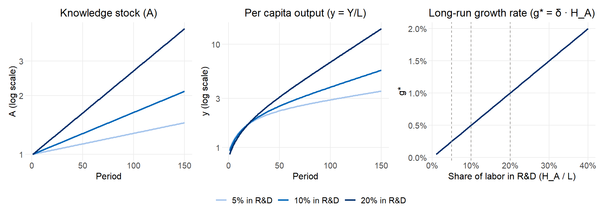

# The Romer Endogenous Growth Model

Catalini et al. build on Romer's (1990) endogenous growth model, adopting its aggregate Cobb-Douglas production structure while reorienting the locus of innovation from the *horizontal expansion of capital varieties* to the *vertical automation of tasks*. A brief tutorial on the Romer model helps anchor what is being borrowed and what is being changed.

## Why Endogenous Growth?

The workhorse Solow model treats technological progress as manna from heaven — an exogenous variable that falls at a fixed rate regardless of any economic decision. This is unsatisfying: it leaves the most important driver of long-run living standards unexplained. Romer's (1990) insight was that **ideas are non-rival**: unlike capital or labor, a piece of knowledge can be used simultaneously by many producers without being depleted. This non-rivalry creates increasing returns to scale overall, which allows growth to be sustained indefinitely through the deliberate allocation of resources to R&D.

## Model Structure

The economy has three sectors:

1. **Final goods production** — firms combine physical capital $K$, production labor $L_Y$, and the existing stock of public knowledge $A$ to produce output $Y$.
2. **R&D** — researchers $H_A$ use the existing knowledge stock to generate new ideas. Because knowledge builds on itself, new discoveries are proportional to the current stock.
3. **Labor market** — the total labor force $L$ is split between production workers and researchers: $L = L_Y + H_A$.

## Key Equations

**Final goods production** (aggregate Cobb-Douglas):

$$Y = A \cdot K^\alpha \cdot L_Y^{1-\alpha} \tag{1}$$

Knowledge $A$ enters as a total factor productivity shifter. Because $A$ is non-rival, doubling $A$ while holding $K$ and $L_Y$ fixed doubles output — this is what breaks the diminishing returns that would otherwise choke off growth.

**Knowledge accumulation** (the engine of growth):

$$\dot{A} = \delta \cdot H_A \cdot A \tag{2}$$

The proportionality to $A$ itself is the key: each new idea makes the next idea cheaper to discover. Research productivity $\delta$ scales the efficiency of R&D labor $H_A$.

**Capital accumulation:**

$$\dot{K} = sY - \delta_K K \tag{3}$$

where $s$ is the savings/investment rate and $\delta_K$ is the rate of capital depreciation.

## The Balanced Growth Path

On the balanced growth path — where all variables grow at constant rates — knowledge and output per capita grow together at:

$$g^* = \frac{\dot{A}}{A} = \delta \cdot H_A \tag{4}$$

This is the central result. Unlike Solow, the long-run growth rate is *endogenous*: it rises with research productivity ($\delta$) and with the number of workers in R&D ($H_A$). A policy that permanently shifts more workers into research permanently raises the growth rate — there is no diminishing returns to scale in ideas.

## Simulation

The simulation below tracks three economies identical except for the share of labor devoted to R&D. On a log scale, each settles into a straight-line path — confirming balanced exponential growth — with slopes proportional to R&D intensity. The third panel makes the linear relationship between $H_A/L$ and $g^*$ explicit.


::: {.cell}

```{.r .cell-code}
library(tidyverse)
library(patchwork)

# Romer model simulation function
romer_sim <- function(T = 150, A0 = 1, K0 = 1, L = 1,
                      ha_share = 0.1, delta = 0.05,
                      alpha = 0.33, s = 0.25, dK = 0.05,
                      label = NULL) {
  H_A <- ha_share * L
  L_Y <- (1 - ha_share) * L

  A <- numeric(T); K <- numeric(T); Y <- numeric(T)
  A[1] <- A0; K[1] <- K0
  Y[1] <- A[1] * K[1]^alpha * L_Y^(1 - alpha)

  for (t in 2:T) {
    A[t] <- A[t-1] * (1 + delta * H_A)
    K[t] <- K[t-1] * (1 - dK) + s * Y[t-1]
    Y[t] <- A[t] * K[t]^alpha * L_Y^(1 - alpha)
  }

  tibble(t = 1:T, A = A, K = K, Y = Y, y = Y / L,
         ha_share = ha_share,
         label = label %||% paste0(ha_share * 100, "% in R&D"))
}

sims <- bind_rows(
  romer_sim(ha_share = 0.05),
  romer_sim(ha_share = 0.10),
  romer_sim(ha_share = 0.20)
) |>
  mutate(label = factor(label, levels = c("5% in R&D", "10% in R&D", "20% in R&D")))

clrs <- c(light_blue, medium_blue, usaid_blue)

p1 <- sims |>
  ggplot(aes(t, A, color = label)) +
  geom_line(linewidth = 1) +
  scale_y_log10(labels = scales::comma) +
  scale_color_manual(values = clrs) +
  labs(title = "Knowledge stock (A)", x = "Period", y = "A (log scale)", color = NULL)

p2 <- sims |>
  ggplot(aes(t, y, color = label)) +
  geom_line(linewidth = 1) +
  scale_y_log10(labels = scales::comma) +
  scale_color_manual(values = clrs) +
  labs(title = "Per capita output (y = Y/L)", x = "Period", y = "y (log scale)", color = NULL)

p3 <- tibble(ha_share = seq(0.01, 0.40, by = 0.01),
             g_star   = 0.05 * ha_share) |>
  ggplot(aes(ha_share, g_star)) +
  geom_line(color = usaid_blue, linewidth = 1) +
  geom_vline(xintercept = c(0.05, 0.10, 0.20), linetype = "dashed", color = medium_grey) +
  scale_x_continuous(labels = scales::percent) +
  scale_y_continuous(labels = scales::percent) +
  labs(title = "Long-run growth rate (g* = δ · H_A)",
       x = "Share of labor in R&D (H_A / L)", y = "g*")

(p1 | p2 | p3) + plot_layout(guides = "collect") &
  theme(legend.position = "bottom")
```

::: {.cell-output-display}
{width=1056}
:::
:::


